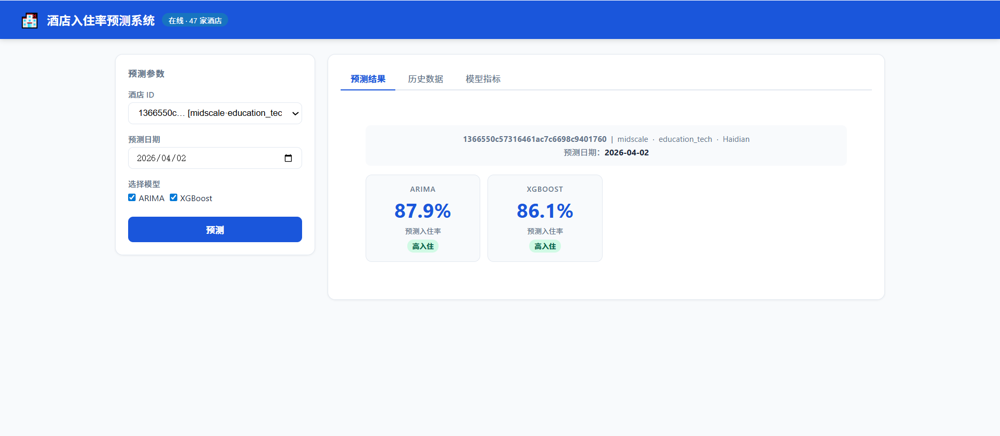
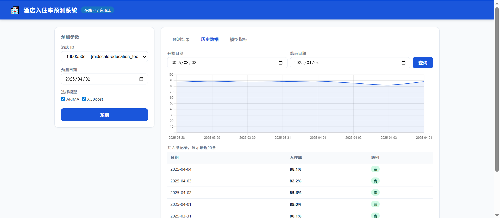
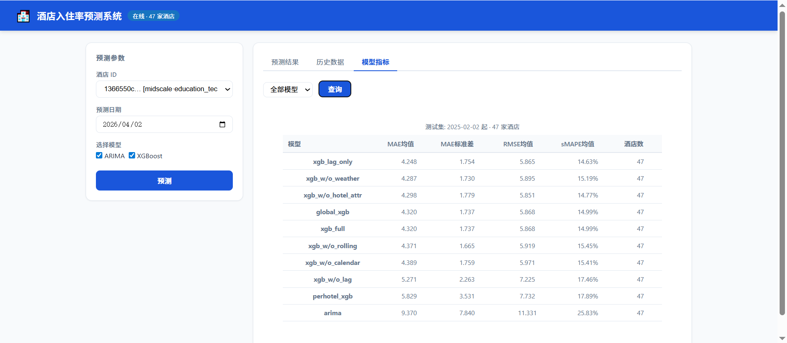

# hotel-occupancy-prediction

English | [简体中文](README-CN.md)

Hotel Occupancy Prediction System (XGBoost + Go API)

---

## Overview

A practical time-series prediction system for hotel occupancy forecasting.

* Models: ARIMA, XGBoost
* Backend: Go (serving) + Python (training)
* Features: time, calendar, weather, lag, rolling
* Includes API + simple frontend visualization

---

## Key Features

* Time-series → supervised learning (lag & rolling features)
* Global XGBoost model (cross-hotel learning)
* Feature ablation experiments
* SHAP explainability
* Go API service

---

## Data

* 47 hotels
* 66k daily records
* Range: 2021-12 ~ 2025-11
* Target: next-day occupancy rate

---

## Tech Stack

* Python: pandas, xgboost, statsmodels, shap
* Go: REST API inference
* Frontend: HTML + Chart.js

---

## Quick Start

### 1. Train

```bash
cd python
python train_all.py
```

### 2. Run API

```bash
go run cmd/server/main.go -python <venv>/python.exe
```

### 3. Open UI

Open `http://localhost:8080`

---

## API

* `/predict` – prediction
* `/history` – historical data
* `/metrics` – model performance
* `/health` – service status

---

## Future Work

* Real weather API
* Multi-step forecasting
* LightGBM / CatBoost comparison

---

## Screenshots

### Prediction Results


### Historical Data


### Model Metrics
